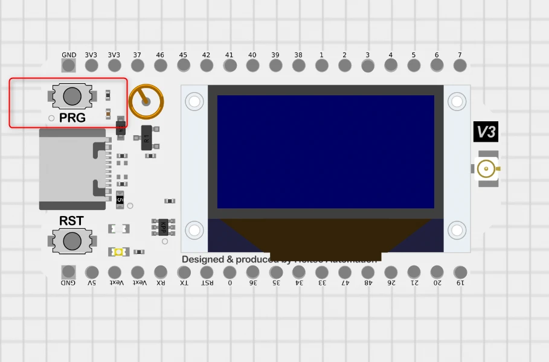
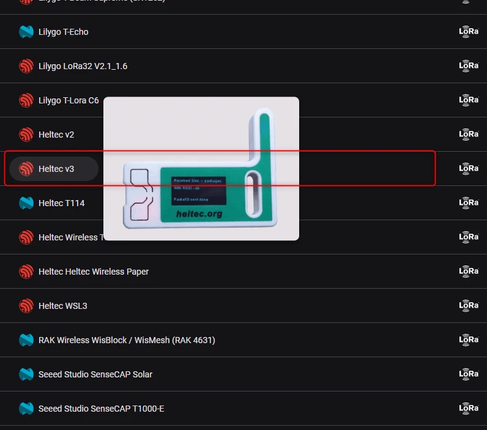
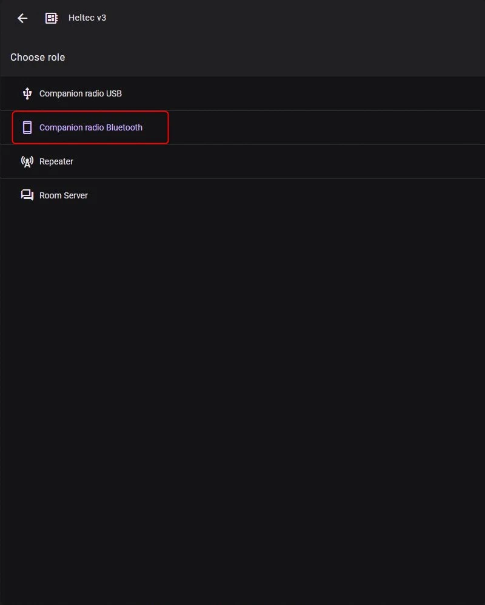
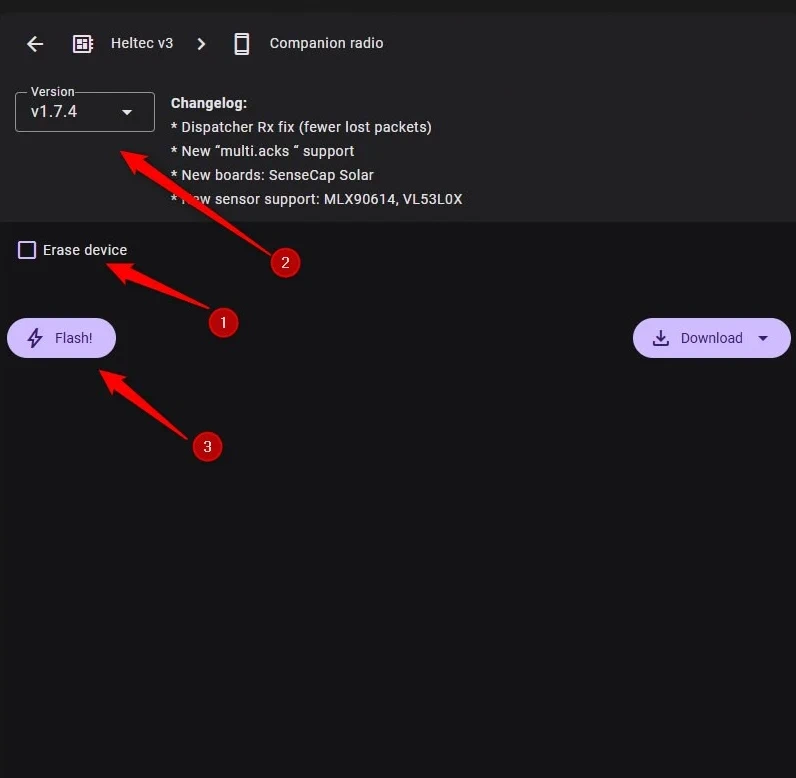
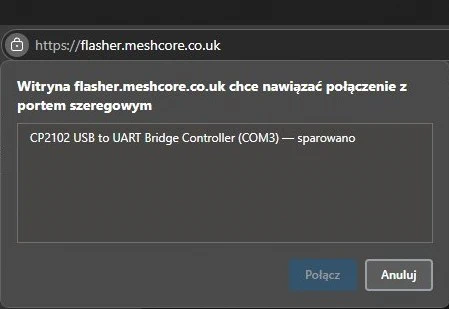
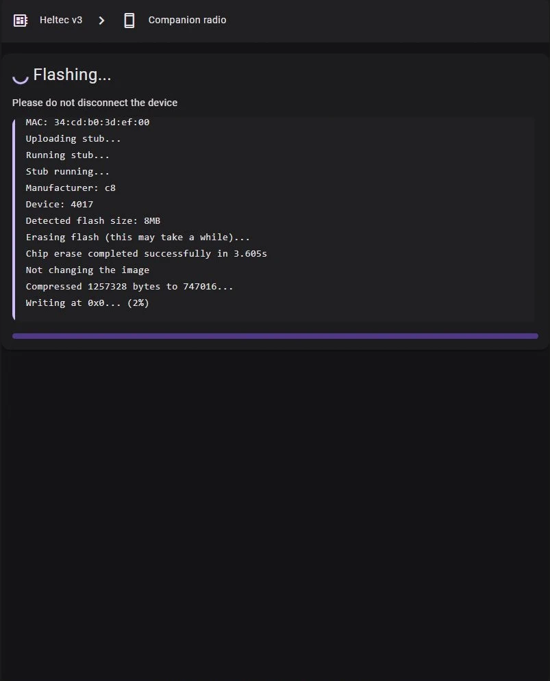

# Instalacja klienta MeshCore na płytce Heltec V3

!!! info
    Poradnik dotyczy flashowania płytki pod systemem Windows.

!!! info
    Przed rozpoczęciem wykonywania tego poradnika zainstaluj przeglądarkę Google Chrome lub Microsoft Edge.

!!! note
    W tym poradniku na płytce zostanie zainstalowanie oprogramowanie typu "klient". Więcej o rolach i ich sposobie działania znajdziesz na <a href ="/zaawansowane/role" target=_blank>tej stronie.</a>

!!! danger
    **Przed podłączeniem płytki do zasilania obowiązkowo podłącz antenę! Urządzenie pracujące bez anteny może ulec uszkodzeniu!**

1. Podłącz kabel USB do płytki.

2. Weź cienki śrubokręt, owiń czubek izolacją, wciśnij i trzymaj przycisk **PRG** na płytce.

    

3. Mając cały czas wciśnięty przycisk PRG, włóż kabel USB do komputera i **puść przycisk PRG po 3 sekundach.** Urządzenie uruchomi się w trybie flashowania.

4. Uruchom przeglądarkę Google Chrome lub Edge i wejdź na <a href="https://flasher.meshcore.co.uk/" target=_blank>tę stronę internetową.</a>

5. Wybierz z listy urządzenie. W naszym przypadku jest to Heltec V3.

    

6. W kolejnym kroku wybierz **Companion Radio Bluetooth**.

    

7. W następnym oknie zaznacz **Erase device**. Ta opcja robi swego rodzaju formatowanie, czyli kasuje wszystkie dane na płytce. Upewnij się również, czy wybrana jest najnowsza wersja oprogramowania. Kliknij na przycisk **Flash**.

    

8. Po kliknięciu na **Flash** pojawi się okno, w którym musimy wybrać naszą płytkę podłączoną do komputera. W moim przypadku podpisana jest ona w następujący sposób:

    

9. Zaznaczamy odpowiednią pozycję i klikamy na **Połącz**. Rozpocznie się procedura zapisu oprogramowania na urządzeniu.

    !!! danger
        Podczas flashowania urządzenia nie zamykaj karty z oknem instalatora oraz nie zamykaj przeglądarki. Cierpliwie poczekaj na zakończenie procesu. 

    

10. Po zakończeniu wgrywania oprogramowania pojawi się komunika **Hard resetting via RTS pin** i płytka uruchomi się ponownie. Po jej uruchomieniu możemy połączyć się z nią przy pomocy telefonu. <a href="/jakZaczac/konfiguracjaAndroid" target=_blank>Kliknij tutaj, aby przejść dalej.</a>