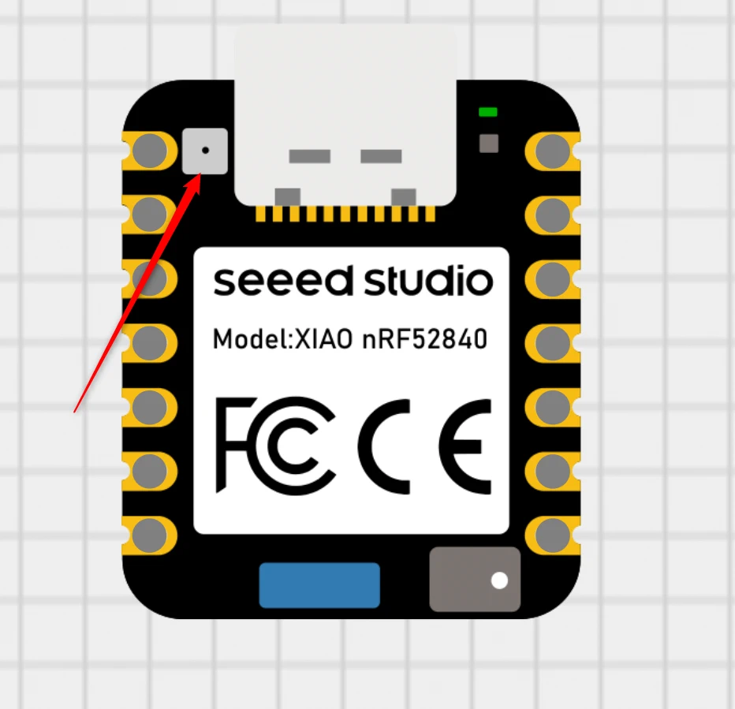
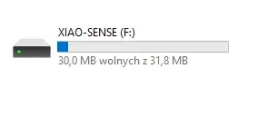
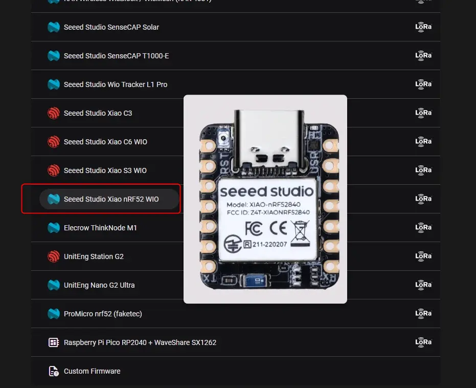
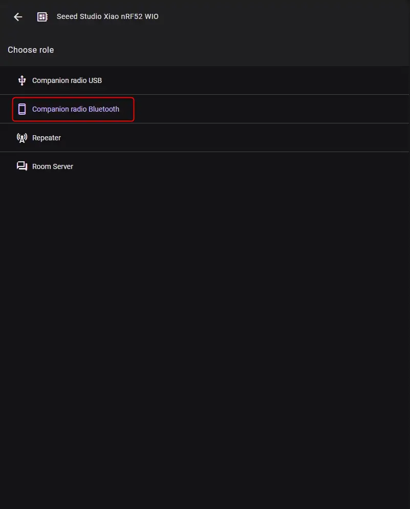
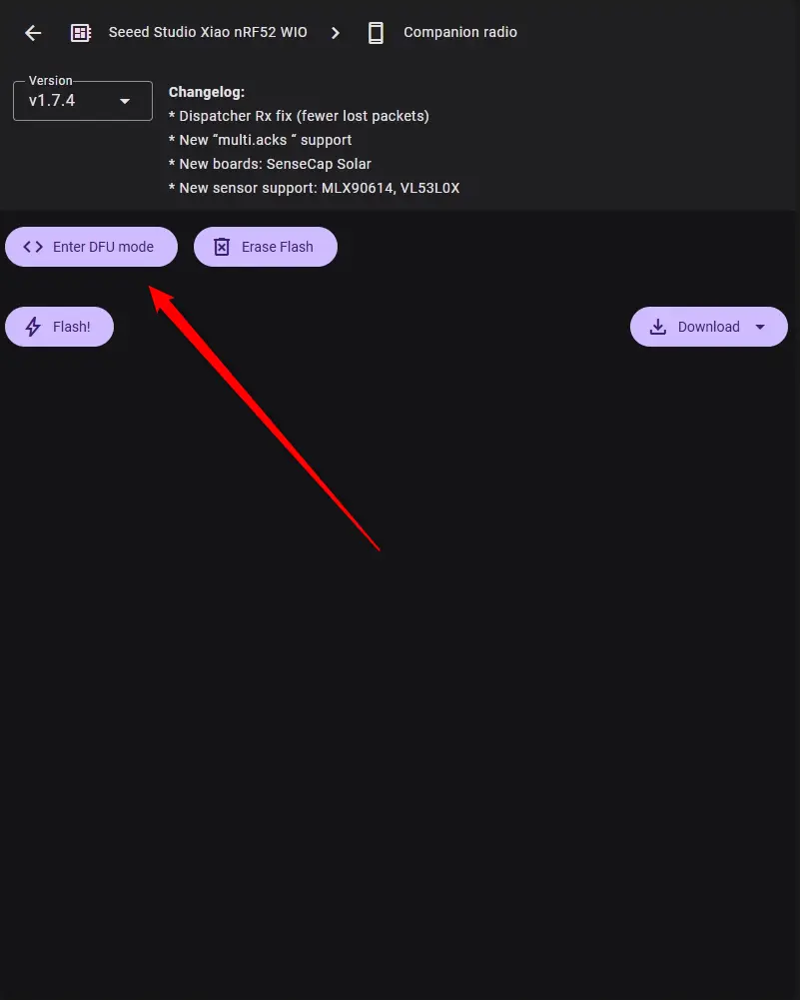
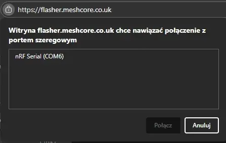
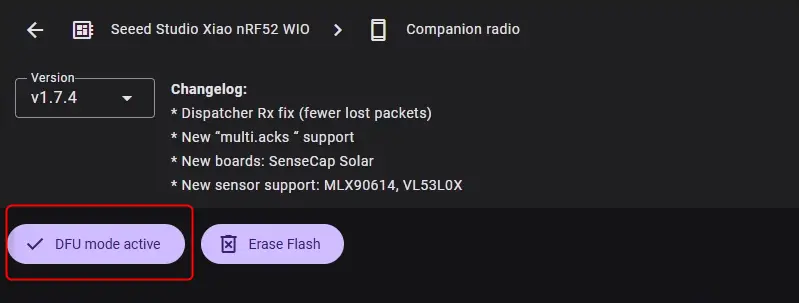
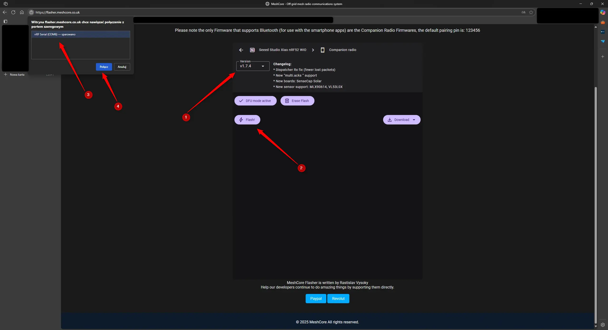
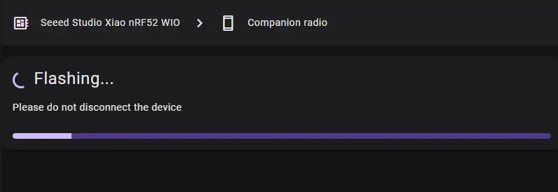
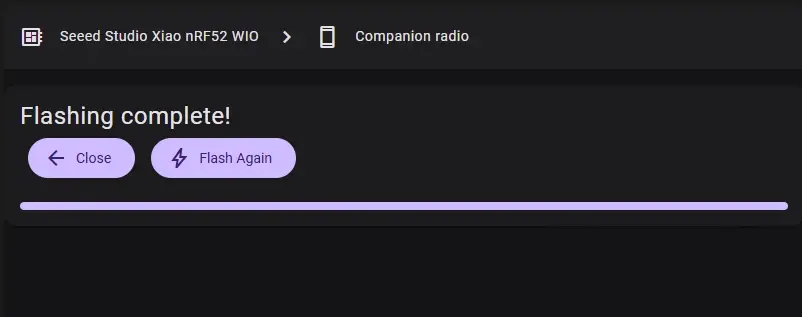

# Instalacja klienta MeshCore na płytce Xiao nRF52840 + Wio-SX1262

!!! info
    Poradnik dotyczy flashowania płytki pod systemem Windows.

!!! info
    Przed rozpoczęciem wykonywania tego poradnika zainstaluj przeglądarkę Google Chrome lub Microsoft Edge.

!!! note
    W tym poradniku na płytce zostanie zainstalowanie oprogramowanie typu "klient". Więcej o rolach i ich sposobie działania znajdziesz na <a href="/zaawansowane/role" target="_blank">tej stronie</a>.

!!! danger
    **Przed podłączeniem płytki do zasilania obowiązkowo podłącz antenę! Urządzenie pracujące bez anteny może ulec uszkodzeniu!**

1. Podłącz kabel USB do płytki, a następnie do komputera.

2. Weź cienki śrubokręt, owiń czubek izolacją i wciśnij dwa razy przycisk **RST**. Ostrożnie dotykaj płytkę, aby nie spowodować zwarcia, tym samym uszkodzenia płytki.
    <figure markdown="span">
        
    </figure>
3. Po chwili na komputerze powinien pojawić się nowy dysk.
    <figure markdown="span">
        
    </figure>
4. Uruchom przeglądarkę Google Chrome lub Microsoft Edge i wejdź na <a href="https://flasher.meshcore.co.uk/" target="_blank">tę stronę internetową.</a>

5. Wybierz z listy urządzenie. W przypadku tego poradnika jest to **Seeed Studio Xiao nRF52 WIO**.
    <figure markdown="span">
        
    </figure>
6. W kolejnym kroku wybierz **Companion Radio Bluetooth**.
    <figure markdown="span">
        
    </figure>
7. Kliknij na przycisk **Enter DFU mode**.
    <figure markdown="span">
        
    </figure>
8. W lewym, górnym rogu powinno pojawić się okno z wyborem urządzenia, w którym to powinna widnieć podłączona płytka. Wybierz ją i kliknij na **Połącz**.
    <figure markdown="span">
        
    </figure>
9. Po kilku sekundach przycisk **Enter DFU mode** powinien zmienić napis na **DFU mode activate**. 
    <figure markdown="span">
        
    </figure>
10. Wybierz najnowszą dostępną wersję, kliknij na **Flash**, i w oknie z lewej strony wybierz płytkę. 
    <figure markdown="span">
        
    </figure>
11. Rozpocznie się procedura zapisu oprogramowania na urządzeniu. 

    !!! danger
        Podczas flashowania urządzenia nie zamykaj karty z oknem instalatora oraz nie zamykaj przeglądarki. Cierpliwie poczekaj na zakończenie procesu. 
    <figure markdown="span">
        
    </figure>
12. Kiedy pojawi się komunikat o zakończeniu procesu flashowania, płytka uruchomi się ponownie już z zainstalowanym oprogramowaniem MeshCore. 
    <figure markdown="span">
        
    </figure>
13.  <a href="/jakZaczac/konfiguracjaAndroid" target=_blank>Kliknij tutaj, aby przejść dalej.</a>
